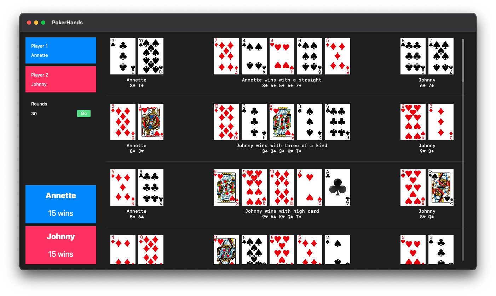

## Texas Holdem Poker Hand Evaluator

Mixing several techniques in Swift to evaluate a Texas Holdem poker hand.

## Techniques

- Compute a rank for each card

- Compute a rank for each possible 5 cards hand

- Permutations of all 5 cards hands among the 7 cards in play

- Sort, filter, deduplicate the results

- Compare ranks by byte matching

- Reorder and extract results

## Why this new version?

I wanted to fix the bugs and improve the speed, but also change the way many objects were modelized, and have a new demo, and... Well, starting a new project made more sense to me rather than updating [the other one](https://github.com/ericdke/PokerHands).

## Demo app

A SwiftUI demo of an all-in heads-up simulator. An executable (macOS11) is available.

## Credits

Cards images are from [Playing Cards iOS Assets](https://github.com/hayeah/playing-cards-assets).

Some hand ranking algorithms are adapted from [swift-poker-hand-evaluator](https://github.com/s4nchez/swift-poker-hand-evaluator).

Mac Catalyst template by [Steven Troughton-Smith](https://github.com/steventroughtonsmith/catalyst-xctemplates).

## License

MIT